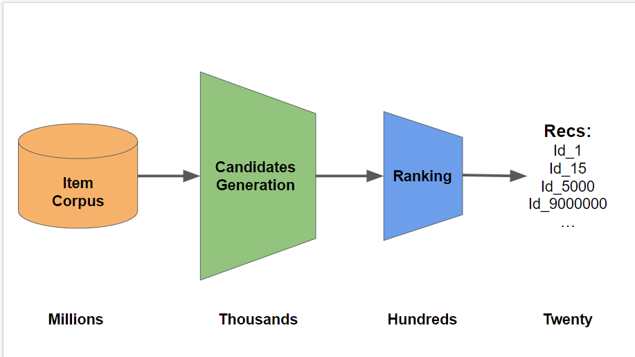

# Multi-Objective Recommender System

## Introduction
This repo. contains code I created during the Kaggle competition OTTO - Multi-Objective Recommender System during January 2023 ([Kaggle Profile for Myles Dunlap](https://www.kaggle.com/dunlap0924)). The approach in this repo. was able to finish in the [top 2% of the 2,587 competing teams](https://www.kaggle.com/competitions/otto-recommender-system/leaderboard). 

The objective of the competition was to predict e-commerce clicks, carts, and orders for a one-week period. The primary approach I took for this competition was a Candidate Ranker model which are commonly used for large dataset recommender systems. Candidate reranker models are explain in References section [1, 2]. 

The basic concept for a candidate reranker model is shown in Figure 1.

<figure>

<figcaption>
Figure 1:  A Large Dataset Candidate Ranker Process [1]</figcaption>
</figure>

In candidate ranker models the item corpus that can contain millions or billions of items and users need to be reduced so that items can be properly recommended to users. The concept is to first create a set of candidates (see candidates generation) which can be done in a multitude of ways; For this competition hand-crafted rules based on human logic, Word2Vec, and Bayseian Personalized Rankking (BPR) were used to provide a variable amounts of candidates and items pairs. The code for generating the candidates was performed in [co_vis_matrices.py](./utils/processing/co_vis_matrices.py) and [candidates.py](./utils/processing/candidates.py).

[Co-visitation matrices](https://www.kaggle.com/code/vslaykovsky/co-visitation-matrix) describe products that are frequenctly viewed and bought together. Three co-visitation matrices were used to provide similar items that were 1) clicked, 2) clicked/carted/ordered, and 3) bought [3]. The [RAPIDS cuDF](https://rapids.ai/) GPU data science library was used to quickly process these matrices as opposed to multi-core dataframe libraries.  

## Data

In this competition the a large dataset was provided for training and testing. The time span of data was approximately 6 weeks and provided by the largest German online shop, [OTTO](https://www.otto.de/). The information in this data The number of events for this dataset, listed below with units of millions, were:
- 12.9M sessions or user
- 1.8M items or aids
- 194.7M clicks
- 16.8M carts
- 5.1M orders


The objective was to recommend the next 20 items a user would: click, cart, and order. 

## Libaries
* Generating Item and User Similarites:
    - [Word2Vec](https://radimrehurek.com/gensim/models/word2vec.html) - for generating items similarities
    - [Implicit](https://github.com/benfred/implicit) using Bayseian Personalized Rankking
        - Research Paper: [BPR: Bayesian Personalized Ranking from Implicit Feedback](https://arxiv.org/pdf/1205.2618.pdf)

- [RAPIDS AI](https://rapids.ai/) - GPU acceleration of data science operations (e.g., dataframes) 
- [POLARS](https://github.com/pola-rs/polars) - Fast dataframe libary written in Rust. This library allows for lazy execuation and is optimized for multi-threaded operations.  
- [XGBoost](https://xgboost.readthedocs.io/en/stable/index.html#) - an XGB Ranker model, using a pairwise objective function, was the model used to refine item recommendations from the first stage of candidates. The XGB Ranker model can be found in file [xgb_ranker.py](./utils/models/xgb_ranker.py). Additionally, the XGB model was trained on the GPU.

```python
# Model Setup
xgb_parms = {'objective':'rank:pairwise',
             'tree_method':'gpu_hist',
             'learning_rate': hps.learning_rate,
             'max_depth': hps.max_depth,
             'colsample_bytree': hps.colsample_bytree,
            }
model = xgb.train(xgb_parms, 
                  dtrain=dtrain,
                  evals=[(dtrain,'train'),
                         (dvalid,'valid')],
                  num_boost_round=hps.num_boost_round,
                  verbose_eval=hps.verbose_eval,
                  early_stopping_rounds=hps.early_stopping_rounds,
                  )
```

In this competition the magnitude of the data would often create Out-of-Memory errors (i.e., not enough RAM) and to handle this issue the data was loaded from Disk in chunks and the XGB model trained in intervals. This was done us in the below code which can be found in [xgb_ranker.py](./utils/models/xgb_ranker.py).

```python 

class IterLoadForDMatrix(xgb.core.DataIter):
    def __init__(self, df=None, features=None, target=None, batch_size=256*1024):
        self.features = features
        self.target = target
        self.df = df
        self.it = 0 # set iterator to 0
        self.batch_size = batch_size
        self.batches = int( np.ceil( len(df) / self.batch_size ) )
        super().__init__()

    def reset(self):
        '''Reset the iterator'''
        self.it = 0

    def next(self, input_data):
        '''Yield next batch of data.'''
        if self.it == self.batches:
            return 0 # Return 0 when there's no more batch.
        
        a = self.it * self.batch_size
        b = min( (self.it + 1) * self.batch_size, len(self.df) )
        dt = cudf.DataFrame(self.df.iloc[a:b])
        input_data(data=dt[self.features], label=dt[self.target]) #, weight=dt['weight'])
        self.it += 1
        return 1


def stratify_folds(df):
    # Stratify Group K-Fold
    skf = GroupKFold(n_splits=5)

    strat = {}
    for fold,(train_idx, valid_idx) in enumerate(skf.split(df, df['target'], groups=df['session'])):
        strat[fold] = {'fold': fold,
                       'train_idx': train_idx,
                       'valid_idx': valid_idx,
                       'num_rows': len(df)}
    return strat
```

## References
1. [Recommendation Systems for Large Datasets](https://www.kaggle.com/competitions/otto-recommender-system/discussion/364721)
2. [How to Build a GBT Ranker Model](https://www.kaggle.com/competitions/otto-recommender-system/discussion/370210)
3. [Candidate ReRank Model using Handcrafted Rules](https://www.kaggle.com/code/cdeotte/candidate-rerank-model-lb-0-575)

